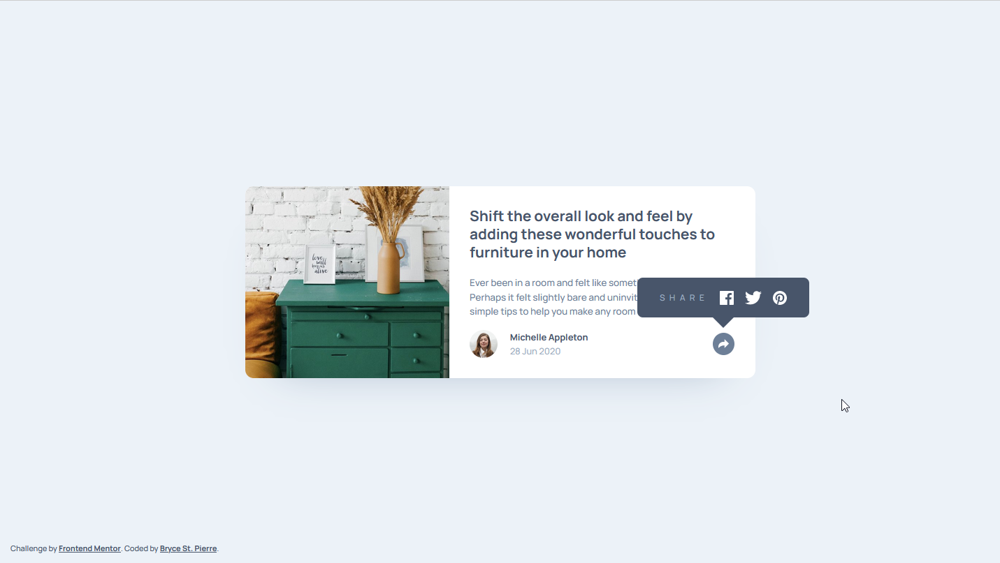

# Frontend Mentor - Article preview component solution

This is a solution to the [Article preview component challenge on Frontend Mentor](https://www.frontendmentor.io/challenges/article-preview-component-dYBN_pYFT). Frontend Mentor challenges help you improve your coding skills by building realistic projects.

## Table of contents

- [Overview](#overview)
  - [The challenge](#the-challenge)
  - [Screenshot](#screenshot)
  - [Links](#links)
- [My process](#my-process)
  - [Built with](#built-with)
  - [What I learned](#what-i-learned)
  - [Useful resources](#useful-resources)
- [Author](#author)

## Overview

### The challenge

Users should be able to:

- View the optimal layout for the component depending on their device's screen size
- See the social media share links when they click the share icon

### Screenshot

### Links

- Solution URL: [GitHub](https://github.com/BryceStPierre/fm-article-preview)
- Live Site URL: [Netlify](https://bsp-article-preview.netlify.app)

## My process

### Built with

- Semantic HTML5 markup
- Sass
- BEM naming conventions
- Flexbox
- CSS Grid
- Mobile-first workflow
- Vanilla JS

### What I learned

In this section I practiced using `rem` units within my CSS, and trying to avoid `px` as much as possible.

### Useful resources

- [MouseEvent.relatedTarget](https://developer.mozilla.org/en-US/docs/Web/API/MouseEvent/relatedTarget) - I used this within the desktop version to verify if the next thing being clicked after the share button lost focus was within the tooltip. If the next element to receive focus wasn't in the tooltip, then it should be closed.

## Author

- Website - [Bryce St. Pierre](https://www.brycestpierre.com)
- Frontend Mentor - [@brycestpierre](https://www.frontendmentor.io/profile/brycestpierre)
- Twitter - [@BryceStPierre](https://www.twitter.com/brycestpierre)
